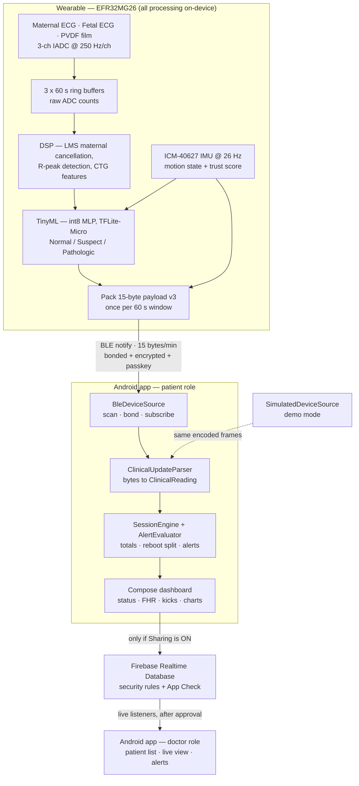
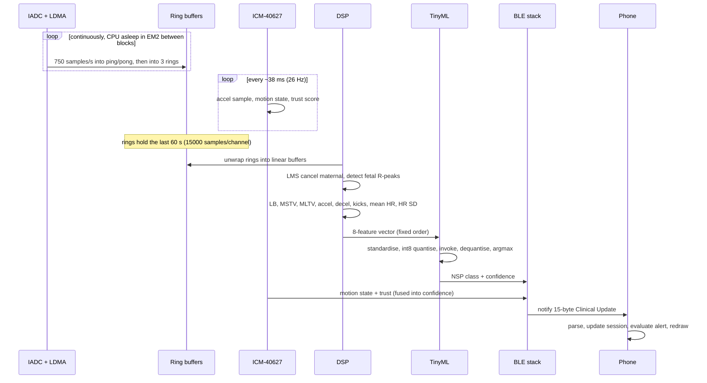
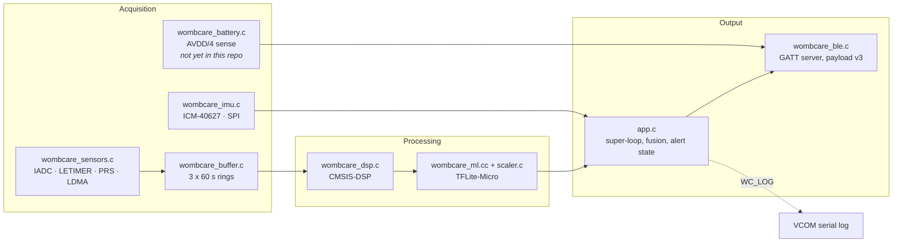
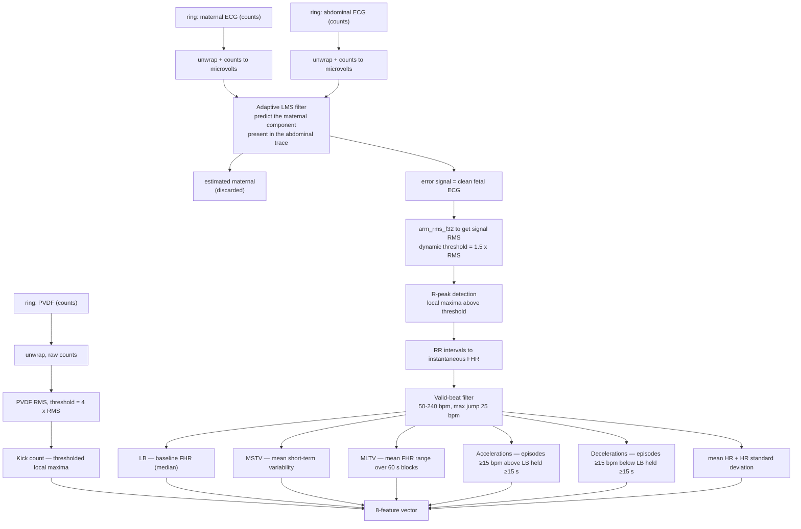
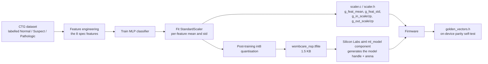
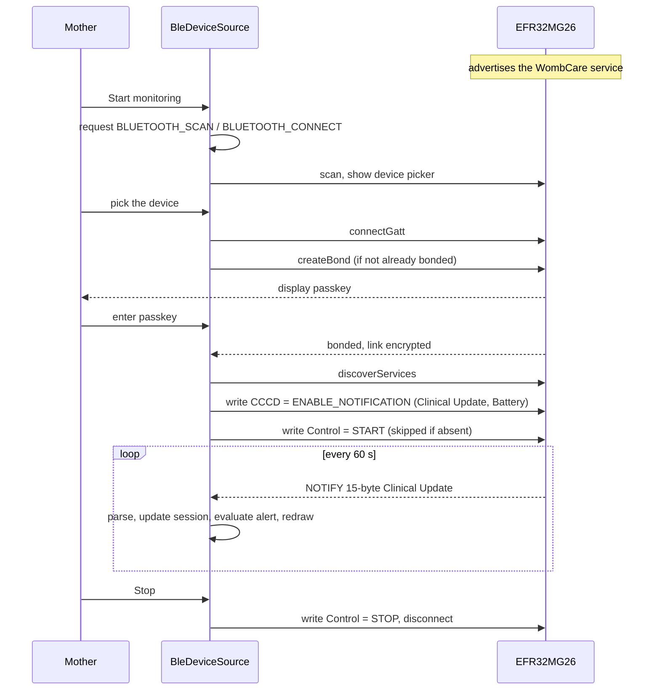
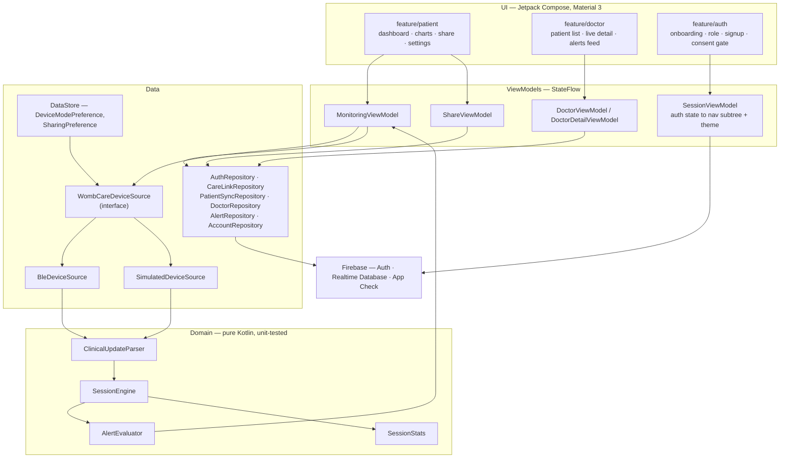
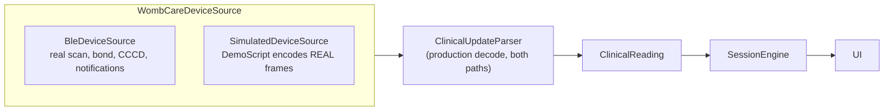
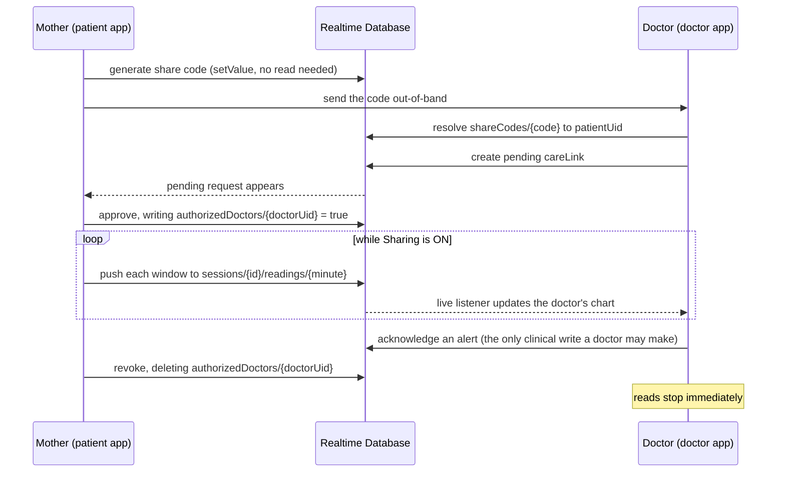

# WombCare — Team SilicoVegas

WombCare is a wearable fetal-wellness monitor built on the Silicon Labs EFR32MG26: a belt-worn
device samples maternal ECG, fetal ECG and a PVDF kick sensor, runs the full DSP and a TinyML
classifier **on-device**, and pushes one 15-byte clinical summary per minute over Bluetooth LE to
an Android companion app that a mother and her doctor share.

> **WombCare is a home wellness-awareness / early-warning aid, not a diagnostic device.** It
> flags patterns associated with reduced fetal wellbeing so that a mother seeks care sooner.
> Nothing in the firmware or the app claims a diagnosis.

**Try the app without hardware:** https://wombcare-icc26.web.app — demo mode is on by default and
plays a full simulated session (live charts, a real alert) through the production code path.

---

## Contents

1. [Repository layout](#repository-layout)
2. [System architecture](#system-architecture)
3. [Hardware requirements](#hardware-requirements)
4. [Hardware Setup](#hardware-setup)
5. [Firmware architecture](#firmware-architecture)
6. [The TinyML model](#the-tinyml-model)
7. [BLE interface](#ble-interface)
8. [Android app architecture](#android-app-architecture)
9. [Cloud data model](#cloud-data-model)
10. [Security model](#security-model)
11. [Build environment setup](#build-environment-setup)
12. [Debug environment](#debug-environment)
13. [Testing and verification status](#testing-and-verification-status)
14. [Contributing](#contributing)
15. [License](#license)

---

## Repository layout

Laid out to the [ICC-26 team repo template](https://github.com/IoT-Challenge-2026/icc-26-team-repo-template):
software projects live under `projects/`, supporting material under `resources/`.

```
.
├── projects/
│   ├── wombcare-firmware/   EFR32MG26 firmware — sensing, DSP, TinyML, BLE
│   └── wombcare-ml/         training pipeline, exported model, data tools
├── resources/
│   └── docs/                feature spec, repository guidelines, handover notes
├── .github/                 CODEOWNERS, PR template, workflows, branch ruleset
├── CLA.md  CODE_OF_CONDUCT.md  LICENSE.md
└── README.md
```

| Project | What it is | Language / toolchain | Build |
|---|---|---|---|
| [wombcare-firmware](projects/wombcare-firmware/) | Wearable firmware — sensing, DSP, TinyML, BLE GATT server | C / C++ · Simplicity SDK 2026.6.0 · GCC 14.2 | [README](projects/wombcare-firmware/README.md) |
| [wombcare-ml](projects/wombcare-ml/) | CTG training pipeline; `artifacts/` holds the exported int8 model | Python · TensorFlow | [README](projects/wombcare-ml/README.md) |

**The Android companion app is maintained separately** and is not a subdirectory here;
references to `wombcare-app/` below point at that separate project.

Key firmware files, all under [projects/wombcare-firmware/](projects/wombcare-firmware/):

| File | Responsibility |
|---|---|
| [src/app.c](projects/wombcare-firmware/src/app.c) | Super-loop: window scheduling, IMU cadence, battery cadence, confidence fusion, device-side alert state |
| [src/wombcare_sensors.c](projects/wombcare-firmware/src/wombcare_sensors.c) | IADC scan queue, LETIMER+PRS trigger, LDMA ping-pong, battery sense |
| [src/wombcare_buffer.c](projects/wombcare-firmware/src/wombcare_buffer.c) | Three 60-second ring buffers of raw ADC counts |
| [src/wombcare_dsp.c](projects/wombcare-firmware/src/wombcare_dsp.c) | LMS maternal-ECG cancellation, R-peak detection, CTG feature extraction |
| [src/wombcare_imu.c](projects/wombcare-firmware/src/wombcare_imu.c) | ICM-40627 over SPI, motion state, movement trust score |
| [src/wombcare_ml.cc](projects/wombcare-firmware/src/wombcare_ml.cc) | Scaler + int8 quantisation + TFLite-Micro inference + argmax |
| [src/wombcare_ble.c](projects/wombcare-firmware/src/wombcare_ble.c) | GATT server, advertising, bonding/passkey, payload v3 packing |

Two invariants hold the project together:

1. **[docs/FEATURE_SPEC.md](resources/docs/FEATURE_SPEC.md) governs the 8-feature vector.** `ml/` and
   `src/wombcare_dsp.c` must compute it identically, or the model silently receives
   out-of-distribution inputs and still returns a confident answer.
2. **`ml/artifacts/ctg/firmware/` is the only copy of the exported model.** The `.slcp`
   compiles `model_data.c` and `scaler.c` from there in place, so retraining cannot leave
   the firmware linked against a model it was not exported for.

The device↔app protocol is specified **once**, in the companion app's `docs/BLE_CONTRACT.md`.
Change that document before changing BLE code on either side.

How we branch, commit and review is in
[docs/repository-guidelines.md](resources/docs/repository-guidelines.md).

---

## System architecture



**The key idea:** raw ECG and IMU never leave the wearable. The device does all the thinking and
transmits a tiny *answer* once a minute; the phone decodes, displays and — only when the mother
explicitly enables sharing — forwards the summary to her doctor.

### One minute in the life of a window



---

## Hardware requirements

| # | Component | Notes |
|---|---|---|
| 1 | **Silicon Labs EFR32xG26 Dev Kit (BRD2608A)** | MCU `EFR32MG26B510F3200IM68` — 3200 KB flash, 512 KB RAM, BLE 5.4. Onboard SEGGER J-Link, so no external debug probe is needed. |
| 2 | **ICM-40627 6-axis IMU** | On the BRD2608A, over SPI (`sl_spidrv_IMU_SPIDRV`). Enable line on `PA10`. Sampled at 26 Hz for maternal motion state (rest / sit / walk) and motion-artifact rejection. |
| 3 | **Maternal ECG electrode channel** | Analog input `PA2` (IADC `PortAPin2`). Ag/AgCl electrodes + analog front end. This is the LMS *reference* for cancelling the mother's heartbeat. |
| 4 | **Fetal (abdominal) ECG electrode channel** | Analog input `PA3` (IADC `PortAPin3`). Carries maternal + fetal ECG mixed; the fetal signal is what survives cancellation. |
| 5 | **PVDF piezo film kick sensor** | Analog input `PB7` (IADC `PortBPin7`). Detects fetal movement. |
| 6 | **Abdominal belt / enclosure** | Holds the electrodes, the PVDF film and the board in a repeatable position. Electrode placement repeatability matters more than electrode brand. |
| 7 | **Li-Po battery** | Level is read through the internal AVDD/4 divider against the 1.21 V reference every 10 s and exposed as the standard BLE Battery Service (`0x180F` / `0x2A19`). |
| 8 | **USB-C cable** | Flashing, power and the VCOM serial log. |
| 9 | **Android phone, Android 8.0+ (API 26)** | Runs the companion app. A **second** phone is needed to demo the doctor side live. |

**Acquisition budget.** One IADC scan queue covers all three channels at **250 Hz per channel**
(750 samples/s total), LETIMER+PRS triggered, LDMA-fed into ping-pong buffers so the CPU stays
asleep between one-second blocks. The three 60-second rings hold raw `uint16` counts:
3 × 15 000 × 2 B = **90 KB of the 512 KB RAM**; conversion to physical units happens on unwrap, not
in storage.

---

## Hardware Setup

```
        ┌──────────── abdominal belt ────────────┐
        │  maternal ECG electrodes ──┐           │
        │  abdominal ECG electrodes ─┤ AFE       │
        │  PVDF piezo film ──────────┘           │
        └───────────────┬────────────────────────┘
                        │ 3 analog channels + common ground
                        ▼
   ┌────────────────────────────────────────────────────────────────┐
   │  EFR32xG26 Dev Kit — BRD2608A (EFR32MG26B510F3200IM68)         │
   │                                                                │
   │   PA2 maternal ECG ─┐                                          │
   │   PA3 abdominal ECG ┼─► IADC scan @250 Hz ─► LDMA ping/pong    │
   │   PB7 PVDF kick ────┘        (LETIMER + PRS trigger)           │
   │                                   │                            │
   │                                   ▼                            │
   │                        60 s ring buffers ─► DSP                │
   │                 LB · MSTV · MLTV · accel/decel · kicks         │
   │                                   │                            │
   │   ICM-40627 IMU ──SPI──► motion ──┤                            │
   │   (PA10 enable)                   ▼                            │
   │                    TinyML NSP classifier (TFLite-Micro)        │
   │                     wombcare_nsp.tflite → Normal /             │
   │                     Suspect / Pathologic + confidence          │
   │                                   │                            │
   │   AVDD/4 ─► IADC ─► battery %     ▼                            │
   │   BTN0 ─► start/stop   BLE GATT server (wombcare_ble.c)        │
   └───────────────────────────────────┬────────────────────────────┘
                                       │ 15-byte notification, 1 per minute
                                       │ bonded + encrypted + passkey (MITM)
                                       ▼
                        ┌──────────────────────────────┐
                        │  Android app — patient (rose)│
                        └──────────────┬───────────────┘
                                       │ only if Sharing is ON
                                       ▼
                     Firebase Realtime Database (rules + App Check)
                                       │ approved, revocable link
                                       ▼
                        ┌──────────────────────────────┐
                        │  Android app — doctor (sky)  │
                        └──────────────────────────────┘
```

### Pin map

| Signal | Pin | Peripheral | Rate |
|---|---|---|---|
| Maternal ECG | `PA2` | IADC scan, channel 0 | 250 Hz |
| Abdominal (fetal) ECG | `PA3` | IADC scan, channel 1 | 250 Hz |
| PVDF kick | `PB7` | IADC scan, channel 2 | 250 Hz |
| Battery | internal AVDD/4 | IADC single, 1.21 V ref | every 10 s |
| IMU | SPI (`sl_spidrv_IMU_SPIDRV`) | ICM-40627 | 26 Hz |
| IMU enable | `PA10` | GPIO out | — |
| Start / stop monitoring | `BTN0` | Simple Button | on press |
| Serial log | VCOM | EUSART iostream | 115200 8N1 |

The **channel order is a contract**: `CH_MOTHER_ECG = 0`, `CH_FETAL_ECG = 1`, `CH_PVDF_KICK = 2`
must stay identical across the ADC scan table, the DMA buffer, the ring buffers, the DSP and the
feature extractor. Reordering one of them silently corrupts every downstream number.

### Physical setup steps

1. Attach the electrode array and the PVDF film to the belt, then fit the belt so the array sits
   on the lower abdomen.
2. Connect the AFE outputs to `PA2`, `PA3` and `PB7` on the dev-kit expansion header, sharing a
   common ground with the board.
3. Connect the battery, or power the kit from USB-C while developing.
4. Plug the kit into the host PC over USB-C — the onboard J-Link enumerates for flash and debug,
   and the VCOM port carries the `app_log` output.
5. Press **BTN0** to start monitoring; the first notification arrives once a full 60-second window
   has been collected.

---

## Firmware architecture

### Module map



`app.c` is a cooperative super-loop driven by `sl_sleeptimer` tick comparisons — no RTOS. Each
pass checks three independent cadences: the IMU sample (26 Hz), the battery read (10 s) and the
analysis window (when the rings hold fresh 60-second data). Everything else sleeps.

### DSP pipeline



Three details that carry most of the signal quality:

- **The maternal heartbeat is cancelled, not filtered out by frequency.** Maternal and fetal ECG
  overlap in band; an LMS adaptive filter uses the maternal channel to predict the maternal
  component inside the abdominal trace, and the *error* it cannot explain is the fetal ECG.
- **Thresholds are dynamic, never absolute.** Both the R-peak threshold (1.5 × RMS) and the kick
  threshold (4 × RMS) are derived from the window's own RMS, so electrode contact quality and
  gain drift don't silently change the beat count.
- **Episodes are counted, not seconds.** An acceleration is one complete episode of ≥15 bpm
  deviation held ≥15 s, so a single long acceleration counts once instead of once per 15 s.

### Feature vector

The model is trained on features computed a *specific* way; a device that computes them
differently feeds out-of-distribution inputs and the model fails **silently** — still returning a
confident answer. The constants in `wombcare_dsp.c` are pinned to `FEATURE_SPEC.md v1` for that
reason, and the order below must never change.

| # | Feature (`WombCareFeatures_t`) | Meaning | Unit |
|---|---|---|---|
| 0 | `lb_bpm` | Baseline fetal heart rate | bpm |
| 1 | `mstv_ms` | Mean short-term variability | bpm (per spec) |
| 2 | `mltv_ms` | Mean long-term variability | bpm (per spec) |
| 3 | `accel_count` | Accelerations | per minute |
| 4 | `decel_count` | Decelerations | per minute |
| 5 | `fetal_movements` | PVDF kick count | per minute |
| 6 | `mean_hr_bpm` | Mean heart rate | bpm |
| 7 | `hr_variance` | Heart-rate spread | bpm (SD on the wire) |

Some struct field names are legacy (`_ms` suffixes, `variance`); the **spec units above** are what
both the scaler and the app expect.

### Device-side clinical state

Beyond the per-window class, `app.c` keeps cross-window state and folds it into the flags byte:

| Rule | Constant | Wire effect |
|---|---|---|
| Pathologic held ≥ 2 minutes | `PERSIST_ALERT_S = 120` | flags bit 7 — persistent alert |
| Baseline below FIGO lower bound ≥ 5 minutes | `SUST_BRADY_S = 300`, `BRADY_LB_BPM = 110` | flags bit 6 — sustained bradycardia |
| IMU trust below threshold | `IMU_TRUST_LOW = 50` | flags bit 5 — motion detected |
| Analysis could not run | — | NSP bits = `3` → app shows **UNKNOWN**, never "Normal" |

**Confidence is fused, not raw.** The reported 0–100 confidence is the ML probability of the
winning class multiplied by the IMU trust score, so heavy maternal movement pulls confidence down
instead of producing a confidently wrong reading. Alert state is reset at the start of each
session so a new run never inherits the previous one's alarm.

---

## The TinyML model

### From dataset to device



### On-device inference

```mermaid
flowchart LR
    F["8 floats<br/>spec order"] --> ST["standardise<br/>(x - mean) / std"]
    ST --> Q["int8 quantise<br/>round(xs / in_scale) + in_zp"]
    Q --> IT["input tensor"]
    IT --> INV["TFLite-Micro invoke<br/>sl_ml_wombcare_nsp_model_handle"]
    INV --> OT["output tensor, 3 x int8"]
    OT --> DQ["dequantise<br/>(y - out_zp) * out_scale"]
    DQ --> AM["argmax to class<br/>+ probability of the winner"]
    AM --> RES["WombCareResult_t<br/>nsp · confidence · 3 probs · ok"]
```



| Property | Value |
|---|---|
| Framework | TensorFlow Lite for Microcontrollers, via the Silicon Labs `aiml` package |
| Model file | [wombcare_nsp.tflite](projects/wombcare-ml/artifacts/ctg/wombcare_nsp_int8.tflite) — **1560 bytes** |
| Input | 8 float features → standardised → int8 |
| Output | 3 classes: `WOMBCARE_NORMAL` / `WOMBCARE_SUSPECT` / `WOMBCARE_PATHOLOGIC` |
| Quantisation | Full int8, scale/zero-point in [scaler.c](projects/wombcare-ml/artifacts/ctg/firmware/scaler.c) |
| Failure mode | `ok = false` → NSP wire value `3` → app shows **UNKNOWN**, not a guess |
| Self-test | [golden_vectors.h](projects/wombcare-ml/artifacts/ctg/firmware/golden_vectors.h) — reference vectors with expected classes, runnable on-device with no subject attached |

`WOMBCARE_ENABLE_ML` in [app.c](projects/wombcare-firmware/src/app.c) gates inference, so the sensing and BLE
chain can be brought up independently of the model.

---

## BLE interface

### GATT table

| Service | UUID | Characteristic | UUID | Properties |
|---|---|---|---|---|
| WombCare Fetal Wellness | `cd3c5a03-11f5-48ae-95bc-07a592bae6d0` | Clinical Update | `d1dd1e97-9fee-479c-9e05-64f67170f1f8` | Notify · **bonded + encrypted + authenticated** · 15 bytes |
| WombCare Fetal Wellness | same | Control *(optional)* | `e1c1eb41-11fe-413a-892c-739648b001c1` | Write — app-side start/stop; current firmware is BTN0-only and the app skips the write when the characteristic is absent |
| Battery Service | `0x180F` | Battery Level | `0x2A19` | Read / Notify |

### Payload v3 — 15 bytes, one per 60-second window

| Byte | Field | Decode |
|---|---|---|
| 0 | `version` == 3 | selects the v3 layout |
| 1 | `flags` | NSP in bits 3–4 (0 Normal, 1 Suspect, 2 Pathologic, **3 = analysis failed → UNKNOWN**); bit7 persistent alert; bit6 sustained bradycardia; bit5 motion detected; bit2 sensor fault; bit1 monitoring; bit0 initialising |
| 2 | `confidence` | 0–100, ML probability × IMU trust |
| 3 | `fhr_bpm` (LB) | bpm; **0 ⇒ null** ("no lock"), never rendered as 0 |
| 4 | `kick_count` | kicks this window |
| 5 | `mstv_x10` | ÷10 ⇒ MSTV in bpm |
| 6 | `mltv_x4` | ÷4 ⇒ MLTV in bpm |
| 7 | `accel_x10` | ÷10 ⇒ accelerations/min |
| 8 | `decel_x10` | ÷10 ⇒ decelerations/min |
| 9 | `mean_hr_bpm` | mean FHR (0 ⇒ null) |
| 10 | `hr_sd_x10` | ÷10 ⇒ FHR standard deviation in bpm |
| 11–12 | `timestamp` | u16 LE window counter → device minute |
| 13 | `motion_state` | 0 resting / 1 sitting / 2 walking |
| 14 | `reserved` | 0 |

Rules the app enforces: **NSP 3 is never displayed as Normal**; when the sensor-fault bit is set,
bytes 5–10 are meaningless zeros so every CTG value decodes to `null` and renders `--`; battery is
deliberately *not* in the payload; the detailed CTG analytics (MSTV, MLTV, accel, decel, mean HR,
HR SD) surface on the doctor's dashboard, while the mother's summary stays at
NSP / FHR / kicks / confidence / battery. Devices still running v1 (8 bytes) decode through the
legacy path unchanged.

### Connection sequence



The bond persists, so reconnects are silent; **Settings → Forget device** removes it
(`removeBond`) when the pairing needs to be redone.

---

## Android app architecture

One binary, two apps: the role chosen at signup drives both the navigation graph and the theme
(rose for patient, sky for doctor).



### Package map

| Package | Contents |
|---|---|
| `core/ble` | `ClinicalUpdateParser`, `ClinicalReading`, `ConnectionState`, `WombCareGatt` (UUIDs) |
| `core/device` | `WombCareDeviceSource` + BLE and simulated implementations, `BleScanner`, `SessionEngine`, `AlertEvaluator`, `SessionStats`, `DemoScript` |
| `core/data` | Repositories, `DbPaths`, `ReadingWire`, `RtdbFlows`, Hilt modules, DataStore preferences |
| `core/ui` | Design system — theme, dimens, type, and components (`StatTile`, `StatusHeroCard`, `ConnectionChip`, …) |
| `core/navigation` | `Routes`, `WombCareNavHost` — the reactive signed-out/signed-in swap |
| `feature/patient` | Dashboard, hand-rolled Canvas charts, share, settings, device scan |
| `feature/doctor` | Patient list, add-by-code, live detail, alerts feed |
| `feature/auth` | Onboarding, role select, signup/login/forgot, legal, consent gate |

### One interface, two device sources



Demo mode is not a mock UI: `SimulatedDeviceSource` **encodes** a scripted clinical arc
(Normal → Suspect → Pathologic → recovery) into real payload bytes and decodes them through the
same parser the radio uses, so the demo exercises production code and the app cannot tell which
source it is running on. It is a runtime toggle in Settings, on by default.

### Rules the app is built around

- **`fhr == 0` becomes `null`** — renders `--`, never `0`; the FHR line *breaks* across gaps
  instead of interpolating, and averages exclude nulls.
- **A backwards timestamp means the device rebooted** — `SessionEngine` starts a fresh session
  instead of stitching old and new data together.
- **Alerts are confirmed, not twitchy** — `AlertEvaluator` requires two consecutive Pathologic
  windows before it fires; low confidence or a signal-low flag downgrades to *recheck* rather than
  alarming.
- **Status is never colour alone** — always colour **plus** icon **plus** word, for accessibility.
- **Reactive routing** — `SessionViewModel` watches Firebase auth state, so a sign-out anywhere
  (or an expiring token) swaps the whole navigation subtree and the theme.

---

## Cloud data model

Firebase **Realtime Database** (not Firestore: RTDB runs on the free Spark plan and fits a
15-bytes-per-minute workload). Every path in the app is built from `DbPaths` — no string literals
— and the tree mirrors `database.rules.json` node for node.

```
profiles/{uid}                       role, displayName
doctors/{uid}                        doctor profile
patients/{patientUid}
  ├── authorizedDoctors/{doctorUid}   true once the mother approves
  ├── liveStatus                      latest reading for the live dot
  ├── sessions/{sessionId}            startedAt (indexed)
  │     └── readings/{minute}         one window, wire-encoded
  └── alerts/{alertId}                createdAt (indexed), acknowledgedBy/At
shareCodes/{code}                     -> patientUid   (resolvable, never enumerable)
careLinks/{doctorUid}/{patientUid}    doctor's view of the link
careLinksByPatient/{patientUid}/{doctorUid}   mother's view, for approve/revoke
consents/{uid}                        write-once consent records
```

### Sharing lifecycle



Master sharing defaults to **OFF** — nothing reaches the cloud until the mother turns it on, and
`PatientSyncRepository` writes only while signed in and sharing. Invalid FHR is omitted on the
wire so it round-trips back to `null` rather than to `0`.

---

## Security model

| Boundary | Threat | Mitigation |
|---|---|---|
| Device ↔ phone | Any nearby BLE client subscribes and reads fetal data (UUIDs are public — they ship in every APK) | Clinical Update requires a **bonded, encrypted, passkey-authenticated** link; the stack refuses notifications otherwise |
| Device ↔ phone | Passive sniffing during pairing | Passkey entry (MITM protection), display-only IO capability |
| Phone ↔ cloud | A non-app client talks to the backend | Firebase App Check |
| Cloud | A doctor reads a patient who never approved them | Rules require `patients/{uid}/authorizedDoctors/{doctorUid} === true` |
| Cloud | Share codes get enumerated | `shareCodes` is unreadable at the collection level; a code can be *resolved* only by an authenticated doctor, never listed |
| Cloud | A doctor edits clinical data | Rules allow doctors exactly one write: `acknowledgedBy` / `acknowledgedAt` on an alert |
| Cloud | Consent is silently rewritten | Consents are write-once |
| Account | Data outlives the account | "Delete my data" unwinds share code, link mirrors, patient node, consents, profile, then the auth user |

Every rule above is covered by the 23 emulator security-rules tests. **Firmware follow-ups** for
the BLE hop are tracked in `wombcare-app/docs/BLE_CONTRACT.md`: add the
`bluetooth_feature_sm` component to the `.slcp`, and move from one shared build-time passkey to a
per-unit passkey derived from the device serial before any real deployment.

---

## Build environment setup

The firmware is developed and verified on **Windows**. The Android app builds on any platform that
runs Android Studio. Tool versions in use are pinned in
[vscode.conf](projects/wombcare-firmware/vscode.conf): Simplicity Studio 6.0.0,
Commander 1.24.1, SEGGER 6.0.32, CMake 3.30.2, Arm GNU toolchain 14.2.rel1.

### Windows

**Firmware — this repository**

1. Install **Simplicity Studio 6** and, in the installer, select the **Simplicity SDK 2026.6.0**
   (Gecko / 32-bit MCU) package and the **AI/ML** extension — the project depends on the `aiml`
   package (`tensorflow_lite_micro`, `ml_model`).
2. Install the **GNU Arm Embedded toolchain 14.2.rel1**, **CMake ≥ 3.25** and **Ninja**. Studio
   ships all three; only add them separately if you build from a plain terminal.
3. Clone this repository and open `Wombcare_PreFinal2.slcp` in Simplicity Studio
   (or in VS Code with the *Silicon Labs* extension). Opening the `.slcp` regenerates `autogen/`
   for your SDK location.
   > In VS Code, the folder containing the `.slcp` must itself be a workspace root, otherwise the
   > Silicon Labs extension does not activate. `iot-26.code-workspace` already does this.
4. Build from the Project Configurator, or from a terminal in `cmake_gcc/`:
   ```
   cmake --workflow --preset project      # configure + build
   ```
   The image lands in `cmake_gcc/build/base/`.
5. Clean:
   ```
   cmake --build build --config base --target clean     # object files only
   ```
   or delete `cmake_gcc/build/` for a full clean. Regenerated `autogen/` content is rebuilt from
   the `.slcp` and can be deleted safely.
6. Flash with Simplicity Commander or the Studio launcher:
   ```
   commander flash cmake_gcc/build/base/Wombcare_PreFinal.hex --device EFR32MG26BxxxF3200
   ```

**Android app — `wombcare-app/`**

1. Install **Android Studio** (Ladybug or newer) and **JDK 17**; the app targets `compileSdk 35`,
   `targetSdk 35`, `minSdk 26`.
2. Add the two machine-local files that are deliberately not in the repository:
   - `wombcare-app/app/google-services.json` — download from the Firebase console for project
     `wombcare-icc26`, app `com.silicovegas.wombcare`.
   - `wombcare-app/local.properties` — `sdk.dir=C:\\path\\to\\Android\\Sdk` (Android Studio writes
     it on first open).
3. Build, test and install:
   ```
   gradlew.bat testDebugUnitTest assembleDebug     # unit tests + debug APK
   gradlew.bat installDebug                        # install on a connected device/emulator
   gradlew.bat clean                               # clean
   ```
4. Optional — security-rules tests against the Firebase emulator:
   ```
   firebase emulators:exec --only auth,database "npm test --prefix firebase"
   ```
5. Optional — a signed release build: copy `keystore.properties.template` to
   `keystore.properties` and point it at a release keystore. Without it the release build stays
   unsigned; debug builds are never blocked. Setup detail:
   `wombcare-app/docs/FIREBASE_SETUP.md`.

### Linux / macOS

Both toolchains are cross-platform and the steps above apply unchanged apart from paths and the
wrapper (`./gradlew` instead of `gradlew.bat`). Simplicity Studio 6 and the Simplicity SDK ship
for Linux and macOS, and the CMake/Ninja build in `cmake_gcc/` is host-independent.
**We have not verified the firmware build on either platform** — Windows is the reference
environment for this project.

---

## Debug environment

### Firmware

- **Serial log.** VCOM rides the same USB-C connection (`sl_iostream_eusart_vcom`). Open it at
  115200 8N1 in Simplicity Studio's console or any terminal to read `app_log` output. The
  once-per-window line is the fastest health check:
  ```
  WINDOW: ok=1 nsp=0 conf=87 fhr=142 kicks=3 flags=0x02 batt=94%
  ```
  `wombcare_debug.h` holds the log-level switches; raise them for per-sample tracing.
- **On-chip debug.** The onboard J-Link supports normal breakpoint debugging from Simplicity
  Studio or VS Code (arm-none-eabi-gdb 6.0.32, debug part `EFR32MG26BxxxF3200`). Useful
  breakpoints, in the order the data flows: the LDMA completion callback in `wombcare_sensors.c`,
  `wombcare_dsp_run_pipeline()`, `wombcare_ml_run()`, and `sl_bt_on_event()` in `wombcare_ble.c`.
- **Bisecting a bad reading.** Work outward from the middle: run the **golden vectors** first — if
  the classifier reproduces its expected classes, the model and the scaler are fine and the fault
  is upstream in sensing or feature extraction; if it doesn't, stop looking at electrodes.
  `WOMBCARE_ENABLE_ML` and `WOMBCARE_ENABLE_BLE` in `app.c` let you isolate the chain further.
- **BLE.** Use **Simplicity Connect** (iOS/Android) to scan, bond and subscribe to *Clinical
  Update*. Because the characteristic requires a bonded, encrypted, passkey-authenticated link, an
  unbonded client is refused notifications **by design** — that refusal is the security feature
  working, not a bug. The passkey is displayed by the device during pairing.
- **Nothing arriving after a successful subscribe?** The device sends only after a *full* 60-second
  window and only while monitoring is on (BTN0) — check the VCOM `WINDOW:` line before suspecting
  the subscription.
- **Energy.** The Energy Profiler shows the expected EM1/EM2 pattern: the device should sit in EM2
  between one-second acquisition blocks. A device stuck in EM1 usually means an EM1 requirement
  was taken and not released.

### Android app

- Logcat filtered on the app's process shows which device source is active, each decoded reading
  and each alert decision.
- **Demo mode** (Settings, on by default) replaces BLE with the simulator, so the whole app can be
  debugged with no hardware and no network.
- Firebase problems: check App Check first (register the debug token printed in logcat on first
  run), then run the emulator rules tests, which reproduce every access-control decision offline.
- A four-minute two-phone runsheet for demos is in
  `wombcare-app/docs/DEMO_SCRIPT.md`; every screen is captured in
  `wombcare-app/docs/SCREENSHOTS.md`.

---

## Testing and verification status

| Layer | Coverage | State |
|---|---|---|
| BLE parser | 14 unit tests — unsigned bytes, all-zero subscribe frame, v1/v3 layouts, `fhr == 0` | ✅ |
| Session engine + alert evaluator | reboot split, invalid-FHR exclusion, confirm-and-persist, signal gating | ✅ |
| Share code + form validation | 12 unit tests | ✅ |
| Security rules | 23 emulator tests against `database.rules.json` | ✅ |
| Android app end-to-end | onboarding → consent → demo arc verified on a Pixel 9 emulator | ✅ |
| Firmware DSP + ML | golden-vector parity self-test on-device | ✅ |
---

## Contributing

Please follow the [CONTRIBUTING](./.github/CONTRIBUTING.md) guideline.

Use the following header in your source code:

```
/***************************************************************************//**
 *Licensed to the Apache Software Foundation (ASF) under one
 *or more contributor license agreements.  See the NOTICE file
 *distributed with this work for additional information
 *regarding copyright ownership.  The ASF licenses this file
 *to you under the Apache License, Version 2.0 (the
 *"License"); you may not use this file except in compliance
 *with the License.  You may obtain a copy of the License at
 *
 *  http://www.apache.org/licenses/LICENSE-2.0
 *
 *Unless required by applicable law or agreed to in writing,
 *software distributed under the License is distributed on an
 *"AS IS" BASIS, WITHOUT WARRANTIES OR CONDITIONS OF ANY
 *KIND, either express or implied.  See the License for the
 *specific language governing permissions and limitations
 *under the License.
 ******************************************************************************/
```

## License

See the [LICENSE.md](./LICENSE.md) file for details.
