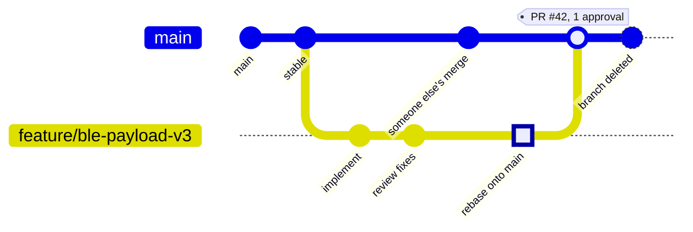

# Repository guidelines — Team SilicoVegas

The working agreement for people with push access to this repository.

> **Two audiences, two documents.** This file is the *internal* team workflow: we branch
> inside the repo and use trunk-based development. External contributors fork instead and
> follow [`.github/CONTRIBUTING.md`](../.github/CONTRIBUTING.md), which carries the Silicon
> Labs branch-naming and CLA requirements. If you have push access here, this file wins.

---

## 1. Branching strategy

Simplified **trunk-based development**. Exactly three branch name forms exist:

| Branch | Purpose | Lifetime |
|---|---|---|
| `main` | The one stable branch. The working code lives here. | Permanent |
| `feature/<short-task-name>` | Adding implementation | Days, not weeks |
| `bugfix/fix-<XY>-issue` | Fixing a problem | Days, not weeks |

Anything else — a bare name, a personal namespace like `nitish/…`, a snapshot name like
`Wombcare_PreFinal2` — is not a branch we keep. See [§6](#6-migrating-the-existing-branches).



### Workflow

1. Pull the latest `main`.
2. Create a small branch off it.
3. Make changes.
4. Commit.
5. Push the branch.
6. Open a pull request.
7. One teammate reviews.
8. Merge into `main`.
9. Delete the branch.

```bash
git checkout main
git pull                                   # always pull before starting work
git checkout -b feature/ble-payload-v3     # one feature per branch

# ... work, then ...
git add -p                                 # stage deliberately, not with -A
git commit                                 # see §3 for the message
git fetch origin
git rebase origin/main                     # §4: rebase before merging
git push -u origin feature/ble-payload-v3
gh pr create                               # then get one approval
```

### Practical rules

- **Never commit directly to `main`.** Enforced by
  [`.github/basic-ruleset.json`](../.github/basic-ruleset.json): `main` requires a pull
  request with one approving review and a code-owner review, blocks force-pushes
  (`non_fast_forward`) and blocks deletion.
- **Always pull before starting work.**
- **Keep branches short-lived.** A long branch is a merge conflict with a delay fuse.
- **One feature per branch.** Two unrelated changes are two branches.
- **Open a pull request before merging.**
- **At least one reviewer approves.**
- **Delete merged branches.**
- **If conflict resolution is unclear, ask before forcing anything.** `--force`,
  `--force-with-lease`, `reset --hard` and `push --force` on a shared branch are
  conversations, not commands.

---

## 2. What does not belong in git

> **Goal:** the project builds on a prepared host PC after a fresh clone.
> "Prepared" means Simplicity Studio, SLC, and the GCC 14.2 toolchain are installed —
> not that the SDK is committed here.

Do not commit generated code. It makes `git diff` dirty and hard to track, and it hides
the real change inside thousands of mechanical lines.

Currently ignored, and why — see [`.gitignore`](../.gitignore) for the authoritative list:

| Path | Regenerated by |
|---|---|
| `simplicity_sdk_*/`, `aiml_*/` | Simplicity Studio / SLC — vendored SDKs |
| `autogen/` | `slc generate` |
| `cmake_gcc/` | `slc generate` |
| `**/build/`, `*.o`, `*.elf`, `*.map`, `*.a` | the compiler |
| `.vscode/`, `.projectlinkstore`, `.silabsExtContext` | your IDE, machine-specific |
| `tools/dat/`, `tools/processed_dat/` | `tools/download_data.py`, `tools/waveform_processing.py` |
| `*.zip`, `*.tar.gz` | archives; fetch or generate instead |

To restore the generated tree after a fresh clone:

```bash
slc generate Wombcare_PreFinal2.slcp -d . --with <board-or-part>
```

`.gitattributes` normalises line endings to LF. Without it, a Windows checkout and a Linux
CI runner disagree on every line of every file and diffs become unreadable.

### Documentation formats

Documentation shall be in **GitHub-supported formats**:

- **Markdown** — [writing on GitHub](https://docs.github.com/en/get-started/writing-on-github/getting-started-with-writing-and-formatting-on-github/quickstart-for-writing-on-github)
- **Mermaid** — <https://mermaid.js.org/>, rendered natively by GitHub

**Avoid `pdf`, `xlsx`, `docx`, `ppt`.** They do not diff, do not review, and do not merge.
`.gitignore` blocks them so the rule cannot be broken by accident.

---

## 3. Commit messages

A commit should represent **one logical change** that can be understood, reviewed, and
reverted independently. It shall contain a short title and optionally a longer description.

```
Add UART timeout handling for disconnected devices

Prevent infinite wait state when the device disconnects during
UART communication. Added timeout recovery and error logging.
```

```bash
git commit -m "title message" -m "description message"
```

Commits must be **signed off and GPG-signed** — see
[`.github/CONTRIBUTING.md`](../.github/CONTRIBUTING.md) for key setup.

---

## 4. Rebase before merging

Rebase your feature branch onto `main` before merging it, so history stays linear and each
change reads as one sequence rather than a braid of merge commits.

```bash
git fetch origin
git rebase origin/main
# resolve conflicts, then
git push --force-with-lease        # your own feature branch only, never main
```

`--force-with-lease` rather than `--force`: it refuses to overwrite work someone else
pushed to your branch while you were rebasing.

---

## 5. Repository layout

```
.
├── src/                    firmware translation units
├── inc/                    firmware headers
├── config/                 SLC board and component configuration (hand-tunable)
├── ml/                     training pipeline; ml/artifacts/ holds exported models
├── tools/                  dataset download and waveform pre-processing scripts
├── docs/                   all documentation
│   ├── FEATURE_SPEC.md     the firmware/model parity contract
│   ├── repository-guidelines.md  this file
│   └── handoff/            phase handover notes
├── .github/                CODEOWNERS, PR template, workflows, branch ruleset
└── Wombcare_PreFinal2.slcp the single SLC project definition
```

System and firmware architecture — module map, the life of a 60-second window, the BLE
payload, the security model — is documented with Mermaid diagrams in the
[README](../README.md). It is not duplicated here.

Two rules hold this together:

1. **[`docs/FEATURE_SPEC.md`](FEATURE_SPEC.md) governs the 8-feature vector.** `ml/` and
   `src/wombcare_dsp.c` must compute it identically. Change the spec first, by agreement,
   and bump `spec_version`.
2. **`ml/artifacts/ctg/firmware/` is the only copy of the exported model.** The `.slcp`
   compiles `model_data.c` and `scaler.c` from there in place. Never copy them elsewhere —
   that is how firmware ends up linked against a model it was not exported for.

---

## 6. Migrating the existing branches

These remote branches predate this document and do not match the naming rules:

| Remote branch | Suggested action |
|---|---|
| `WombCare_Firmware`, `wombcare_firmware` | Merge or delete — near-duplicate names differing only in case |
| `Wombcare_PreFinal`, `Wombcare_PreFinal2`, `Wombcare_7PreFinal` | Snapshot branches — tag the useful commits, then delete |
| `wombcare-initial-submission` | Tag as `v0.1-initial-submission`, then delete |
| `feature_sensor` | Rename to `feature/sensor` or delete if merged |
| `nitish/firmware-ble-integration` | Rename to `feature/ble-integration` or delete if merged |
| `nitish/ml-developement+app-development-v1` | Rename to `feature/ml-and-app-v1` or delete if merged |
| `nitish/ml-nsp-ctg-pipeline` | Rename to `feature/ml-nsp-ctg-pipeline` or delete if merged |

Confirm each is merged before deleting:

```bash
git branch -r --merged origin/main        # safe to delete
git branch -r --no-merged origin/main     # inspect before touching
```

Prefer a tag over a snapshot branch. A tag records "this is what we submitted" without
inviting anyone to commit to it.
