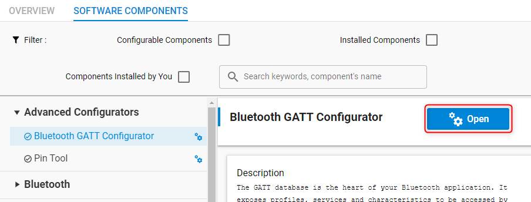
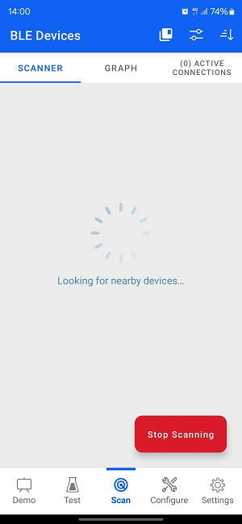
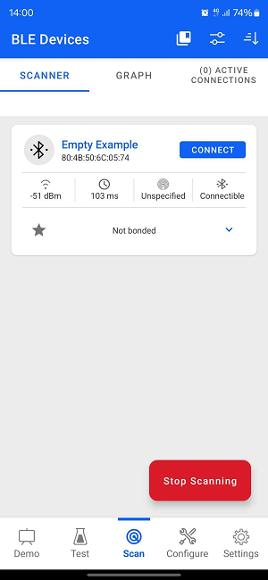
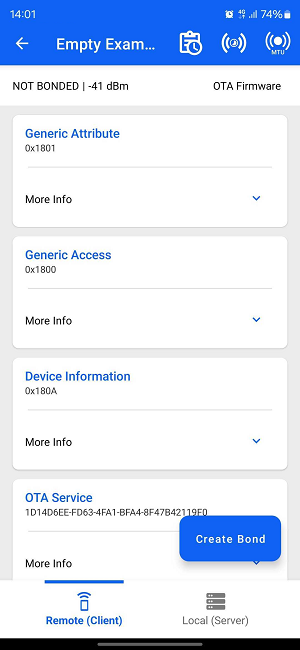

# WombCare Firmware

> The sections from **SoC - Empty** onward are the stock Silicon Labs template
> documentation for the underlying Bluetooth example project.

## ML optimization — 240 s analysis window

The on-device NSP classifier (Normal / Suspect / Pathologic) is a class-weighted
multinomial logistic regression trained on the UCI Cardiotocography dataset and
deployed as a 1.5 KB int8 TFLite-Micro model. This change fixes a **train/serve
mismatch** in what that model was being fed.

### The problem

The model is trained on CTG segments whose **median duration is 3.3 minutes**
(mean 3.44, IQR 2.55–4.34). The DSP window was **60 s**, so the model was scored
on one-minute features it had never seen in training. It hurts most on the
features the model leans on hardest:

- **`AC_rate` / `DEC_rate` are episode counts.** At the training mean rates (0.76
  and 0.45 per minute) a 60 s window contains **zero accelerations 47% of the
  time** and **zero decelerations 64% of the time** — by chance, not because
  anything is wrong. The model reads an empty minute as a warning sign.
- **An episode must last ≥15 s to count.** Inside a 60 s window an episode fits
  entirely within the window only ~75% of the time ((60−15)/60); over 240 s it is
  ~94%. The old window therefore **under-counted both features by roughly a
  fifth** relative to how the training data was built.
- **`MLTV` is the mean FHR range over consecutive 60 s blocks.** A 60 s window
  holds exactly one block, so "mean over blocks" averaged a single sample.

Scoring the deployed model by segment duration under recording-level CV shows the
cost: **0.810 accuracy on >4 min segments vs 0.720 on <2 min segments.**

### The fix

`wombcare_trend.c` keeps a **rolling 4-minute beat trend**. Widening the raw ring
buffer was never an option — the three rings plus `scratch_pool` already sit near
330 KB of the part's 512 KB. But every feature is derived from the **beat
series**, not the waveform, so only the beats need to persist:

- Beat detection still runs on the **unchanged 60 s ring buffer**.
- The derived beats accumulate into the trend and age out past `TREND_SPAN_MS`.
- `compute_features()` (extracted from the pipeline) builds the vector from the
  whole retained span. **The feature definitions are unchanged** — only the span.

Cost: **8,352 B RAM, 2,072 B flash.**

### What does not change

**The cadence and the BLE contract.** A fresh vector is still emitted every 60 s,
so BLE, the app and the alert logic see exactly the timing they saw before.
Payload stays **v4, 16 bytes** — no app parser update required. During the first
minutes of a session the trend normalises to the observation time it actually
has, so early readings match the previous behaviour rather than blanking the UI.

Two details that matter for correctness:

- **Rejected windows are real gaps.** `wombcare_trend_begin_window()` runs before
  any gate can reject the window, so every early-return path still advances the
  clock. Episodes and MSTV break across discontinuities — otherwise a rejected
  minute would fuse two unrelated excursions into one long false episode.
- **The rate denominator is observed time, not elapsed time** — the summed length
  of the accepted windows still in the trend. Using wall clock would halve the
  reported rate on a device rejecting half its windows.

### Verification

`tools/trend_selftest/` runs the real `wombcare_dsp.c` on a PC against synthetic
beat series. It `#include`s the DSP source so it can drive the static
`compute_features()` directly — the existing `tools/dsp_selftest/` never gets a
window accepted, so it could not reach the feature code at all.

```sh
sh tools/dsp_selftest/run.sh      # 14/14 safety checks (unchanged)
sh tools/trend_selftest/run.sh    # 15/15 trend + feature checks
```

The headline case, same function and input, only the span differing:

```
-- a 20 s acceleration across a window boundary --
     per-60s-window, summed : 0 accelerations
     over the 2-minute span : 1 accelerations
```

See `wombcare_trend.h` for the full rationale and `wombcare-pr/FEATURE_SPEC.md`
§G3 (open item **O-A**, now closed).

---

# SoC - Empty

The Bluetooth SoC-Empty example is a project that you can use as a template for any standalone Bluetooth application.

> Note: This example does not include Device Firmware Update (DFU) functionality by default. For details see the [Device Firmware Update](#device-firmware-update) section.

## Getting Started

To learn the Bluetooth technology basics, see [UG103.14: Bluetooth LE Fundamentals](https://www.silabs.com/documents/public/user-guides/ug103-14-fundamentals-ble.pdf).

To get started with Silicon Labs Bluetooth and Simplicity Studio, see [QSG169: Bluetooth SDK v3.x Quick Start Guide](https://www.silabs.com/documents/public/quick-start-guides/qsg169-bluetooth-sdk-v3x-quick-start-guide.pdf).

The term SoC stands for "System on Chip", meaning that this is a standalone application that runs on the EFR32/BGM and does not require any external MCU or other active components to operate.

As the name implies, the example is an (almost) empty template that has only the bare minimum to make a working Bluetooth application. This skeleton can be extended with the application logic.

The development of a Bluetooth applications consist of three main steps:

* Designing the GATT database
* Responding to the events raised by the Bluetooth stack
* Implementing additional application logic

These steps are covered in the following sections. To learn more about programming an SoC application, see [UG434: Silicon Labs Bluetooth ® C Application Developer's Guide for SDK v3.x](https://www.silabs.com/documents/public/user-guides/ug434-bluetooth-c-soc-dev-guide-sdk-v3x.pdf).

## Designing the GATT Database

The SOC-empty example implements a basic GATT database. GATT definitions (services/characteristics) can be extended using the GATT Configurator, which can be found under Advanced Configurators in the Software Components tab of the Project Configurator. To open the Project Configurator, open the .slcp file of the project.



To learn how to use the GATT Configurator, see [UG438: GATT Configurator User’s Guide for Bluetooth SDK v3.x](https://www.silabs.com/documents/public/user-guides/ug438-gatt-configurator-users-guide-sdk-v3x.pdf).

## Responding to Bluetooth Events

A Bluetooth application is event driven. The Bluetooth stack generates events e.g., when a remote device connects or disconnects or when it writes a characteristic in the local GATT database. The application has to handle these events in the `sl_bt_on_event()` function. The prototype of this function is implemented in *app.c*. To handle more events, the switch-case statement of this function is to be extended. For the list of Bluetooth events, see the online [Bluetooth API Reference](https://docs.silabs.com/bluetooth/latest/).

## Implementing Application Logic

Additional application logic has to be implemented in the `app_init()` and `app_process_action()` functions. Find the definitions of these functions in *app.c*. The `app_init()` function is called once when the device is booted, and `app_process_action()` is called repeatedly in a while(1) loop. For example, you can poll peripherals in this function. To save energy and to have this function called at specific intervals only, for example once every second, use the services of the [Sleeptimer](https://docs.silabs.com/gecko-platform/latest/service/api/group-sleeptimer). If you need a more sophisticated application, consider using RTOS (see [AN1260: Integrating v3.x Silicon Labs Bluetooth Applications with Real-Time Operating Systems](https://www.silabs.com/documents/public/application-notes/an1260-integrating-v3x-bluetooth-applications-with-rtos.pdf)).

## Features Already Added to the SOC-Empty Application

The SOC-Empty application is ***almost*** empty. It implements a basic application to demonstrate how to handle events, how to use the GATT database, and how to add software components.

* A simple application is implemented in the event handler function that starts advertising on boot (and on connection_closed event). This makes it possible for remote devices to find the device and connect to it.
* A simple GATT database is defined by adding Generic Access and Device Information services. This makes it possible for remote devices to read out some basic information such as the device name.
* The OTA DFU software component is added, which extends both the event handlers (see *sl_ota_dfu.c*) and the GATT database (see *ota_dfu.xml*). This makes it possible to make Over-The-Air Device-Firmware-Upgrade without any additional application code.

## Testing the SOC-Empty Application

As described above, an empty example does nothing except advertising and letting other devices connect and read its basic GATT database. To test this feature, do the following:

1. Build and flash the SoC-Empty example to your device.
2. In case of using DFU functionality, make sure a bootloader is installed. See the [Device Firmware Update](#device-firmware-update) section.
3. Download the **Simplicity Connect** smartphone app, available on [iOS](https://apps.apple.com/us/app/simplicity-connect/id1030932759) and [Android](https://play.google.com/store/apps/details?id=com.siliconlabs.bledemo&hl=en&gl=US).
4. Open the app and choose the [Scan].
   
5. Now you should find your device advertising as "Empty Example". Tap **Connect**.
   
6. The connection is opened, and the GATT database is automatically discovered. Find the device name characteristic under Generic Access service and try to read out the device name.
   

## Device Firmware Update

This example project does not include Device Firmware Update (DFU) functionality by default, but it can be added easily.
SoC applications can use one of Silicon Labs' Over-the-Air (OTA) DFU implementations. The table below summarizes the options:

|                           | In-place OTA DFU                 | Application OTA DFU                 |
|---------------------------|----------------------------------|-------------------------------------|
| **Component to add**      | In-place OTA DFU                 | Application OTA DFU                 |
| **Compatible bootloader** | Bluetooth Apploader OTA DFU      | Bootloader - SoC Internal Storage (Series 2) <br> Bootloader - SoC Storage (Series 3) |
| **Reference solution**    | Bluetooth - SoC In-Place OTA DFU | Bluetooth - SoC Application OTA DFU |
| **Supported devices**     | Supports Series 2 devices only and requires a smaller flash size | Supports Series 2 and Series 3 devices with enough flash to store firmware images in 2 instances |

To add DFU to an existing project:
- Add the appropriate DFU component to your project using Simplicity Studio’s Software Component browser.
- Add a post-build step to generate the GBL (Gecko Bootloader) file using Simplicity Studio’s Post Build Editor.
- Rebuild the project.
- Flash a compatible bootloader to the device.

For more information on bootloaders, see [UG103.6: Bootloader Fundamentals](https://www.silabs.com/documents/public/user-guides/ug103-06-fundamentals-bootloading.pdf) and [UG489: Silicon Labs Gecko Bootloader User's Guide for GSDK 4.0 and Higher](https://www.silabs.com/documents/public/user-guides/ug489-gecko-bootloader-user-guide-gsdk-4.pdf).

## Troubleshooting

### Programming the Radio Board

Before programming the radio board mounted on the mainboard, make sure the power supply switch is in the AEM position (right side) as shown below.


## Resources

[Bluetooth Documentation](https://docs.silabs.com/bluetooth/latest/)

[UG103.14: Bluetooth LE Fundamentals](https://www.silabs.com/documents/public/user-guides/ug103-14-fundamentals-ble.pdf)

[QSG169: Bluetooth SDK v3.x Quick Start Guide](https://www.silabs.com/documents/public/quick-start-guides/qsg169-bluetooth-sdk-v3x-quick-start-guide.pdf)

[UG434: Silicon Labs Bluetooth ® C Application Developer's Guide for SDK v3.x](https://www.silabs.com/documents/public/user-guides/ug434-bluetooth-c-soc-dev-guide-sdk-v3x.pdf)

[Bluetooth Training](https://www.silabs.com/support/training/bluetooth)

## Report Bugs & Get Support

You are always encouraged and welcome to report any issues you found to us via [Silicon Labs Community](https://www.silabs.com/community).
